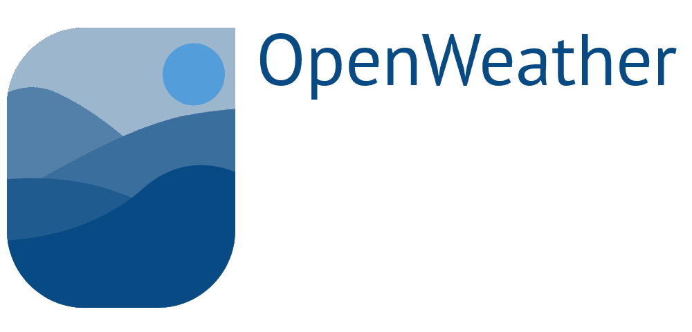

<!-- PROJECT LOGO -->
<p align="center">
  <a href="https://github.com/lucasmontano/openweathermap-rn-expo">
    
  </a>

  <p align="center">
    A fast and useful way to see informations about the daily weather.
    <br />
    <a href="https://github.com/lucasmontano/openweathermap-rn-expo"><strong>Explore the docs »</strong></a>
    <br />
    <br />
    <a href="https://github.com/lucasmontano/openweathermap-rn-expo">View Demo</a>
    ·
    <a href="https://github.com/lucasmontano/openweathermap-rn-expo/issues">Report Bug</a>
    ·
    <a href="https://github.com/lucasmontano/openweathermap-rn-expo/issues">Request Feature</a>
  </p>
</p>

<!-- PROJECT SHIELDS -->
<!--
*** I'm using markdown "reference style" links for readability.
*** Reference links are enclosed in brackets [ ] instead of parentheses ( ).
*** See the bottom of this document for the declaration of the reference variables
*** for contributors-url, forks-url, etc. This is an optional, concise syntax you may use.
*** https://www.markdownguide.org/basic-syntax/#reference-style-links
-->
<div align="center">

  [![Contributors][contributors-shield]][contributors-url]
  [![Forks][forks-shield]][forks-url]
  [![Stargazers][stars-shield]][stars-url]
  [![Issues][issues-shield]][issues-url]
  [![Made By][made-by-shield]][made-by-url]
  [![Last Commit][last-commit-shield]][last-commit-url]
  [![MIT License][license-shield]][license-url]

</div>
<br />

<h2 id="table-of-contents">📑 Table of Contents</h2>

<ul>
  <li><a href="#about-the-project">About the Project</a></li>
  <li><a href="#getting-started">Getting Started</a></li>
    <ul>
      <li><a href="#prerequisites">Prerequisites</a></li>
      <li><a href="#clone">Clone</a></li>
      <li><a href="#setup">Setup</a></li>
    </ul>
  <li><a href="#features">Features</a></li>
    <ul>
      <li><a href="#documentation">Documentation</a></li>
      <li><a href="#built-with">Built with</a></li>
    </ul>
  <li><a href="#contributing">Contributing</a></li>
  <li><a href="#support">Support</a></li>
  <li><a href="#license">License</a></li>
  <li><a href="#other-platforms">Other Platforms</a></li>
</ul>

<br />

<h2 id="about-the-project">📖 About the Project</h2>

OpenWeather is a project created by Lucas Montano initially as an One-Day-Challange, then he decided to create an Open Source project to help his followers and everyone getting started with Open Source world world building a basic but very strategic application!

<br />

<h2 id="getting-started">🚀 Getting Started</h2>

<h3 id="prerequisites">Prerequisites</h3>

- To run any React Native application using Expo you need to configure the environment on your machine.

- Setting the environment sometimes is a complex process, so it's recommended to follow the Expo guide, in documentation of this technology, that is currently the most complete and detailed tutorial to set up all needed tools and configurations.

#### [**Expo Guide**](https://docs.expo.io/versions/latest/get-started/installation/)

<h3 id="clone">Clone</h3>

- Clone this repo to your local machine using:

```sh
  git clone https://github.com/lucasmontano/openweathermap-rn-expo.git
```

<h3 id="setup">Setup</h3>

1. Go to project folder and install all the packages and dependencies:

```sh
  # if you are using NPM
  npm install

  # if you are using Yarn
  yarn
```
2. Start the Metro Bundler of Expo:

```sh
  # if you are using NPM
  npm start

  #if you are using Yarn
  yarn start
```

3. Open the app in your device:

- 🍎 On your iPhone or iPad, open the default Apple "Camera" app and scan the QR code you see in the terminal or in Expo Dev Tools.
- 🤖 On your Android device, press "Scan QR Code" on the "Projects" tab of the Expo client app and scan the QR code you see in the terminal or in Expo Dev Tools.

> If some error happen in the connection, use these [informations](https://docs.expo.io/versions/v37.0.0/get-started/create-a-new-app/) to try solve the problem.

<br />

<h2 id="features">📋 Features</h2>

<h3 id="documentation">Documentation</h3>

- [ ] Explore the Earth Weather forecast (Real Time)
- [ ] Check detailed information about the weather by coordinates (lat, lon)
- [ ] Bookmark a location
- [ ] Visualize all bookmarked locations in the map
- [ ] Remove a bookmark
- [ ] Data Cache
- [ ] Theme Switcher (Light/Dark Mode)
- [ ] One way data flow (implement a state reducer)
- [ ] Unique source of truth, implementing a centralized repository
- [ ] Search functionality
- [ ] Five+ days forecast
- [ ] Write some tests (of course)

<h3 id="built-with">Built with</h3>

- Core
  - [React Native](https://reactnative.dev/) - A framework for building native apps with React
- Navigation
  - [React Navigation](https://reactnavigation.org/) - Routing and navigation for your React Native apps
- Debugging
  - [Reactotron](https://github.com/infinitered/reactotron) - Reactotron is a macOS, Windows, and Linux app for inspecting your React JS and React Native apps
- Styling
  - [Styled Components](https://styled-components.com/) - Use the best bits of ES6 and CSS to style your apps without stress
- HTTP Comunication
  - [Axios](https://github.com/axios/axios) - Promise based HTTP client for the browser and node.js
- Type Checking
  - [prop-types](https://github.com/facebook/prop-types) - Runtime type checking for React props and similar objects
- Linting
  - [ESLint](https://github.com/eslint/eslint) - Find and fix problems in your JavaScript code
  - [Prettier](https://prettier.io/) - Prettier is an opinionated code formatter
- Extra
  - [react-native-gesture-handler](https://github.com/software-mansion/react-native-gesture-handler) - Declarative API exposing platform native touch and gesture system to React Native
  - [babel-plugin-root-import](https://github.com/entwicklerstube/babel-plugin-root-import) - Babel plugin to add the opportunity to use import and require with root based paths
  - [eslint-config-airbnb](https://github.com/airbnb/javascript) - A mostly reasonable approach to JavaScript

<br />

<h2 id="contributing">🤔 Contributing</h2>

> To get started...

### Step 1

- 🍴 Fork this repo!

### Step 2

- 👯 Clone this repo to your local machine using `git clone https://github.com/lucasmontano/openweathermap-reactnative.git`

### Step 3

- 🎋 Create your feature branch using `git checkout -b my-feature`

### Step 4

- ✅ Commit your changes using `git commit -m 'feat: My new feature'`;

### Step 5

- 📌 Push to the branch using `git push origin my-feature`;

### Step 6

- 🔃 Create a new pull request

After your Pull Request is merged, can you delete your feature branch.

<br />

<h2 id="support">📌 Support</h2>

Reach out to me at one of the following places!

- Twitter at [@lucas_montano](https://twitter.com/lucas_montano)
- Instagram at [@lucasmontano](https://www.instagram.com/lucasmontano/)
- Linkedin at [Lucas Montano](https://www.linkedin.com/in/lucasmontano/)
- Youtube at [Lucas Montano](https://www.youtube.com/lucasmontano)

<br />

<h2 id="license">📝 License</h2>

This project is licensed under the MIT License - see the [`LICENSE`](LICENSE) file for details.

<br />

<h2 id="other-platforms">⚒ Other Platforms</h2>

Open Weather on Other Platforms:

- Android: https://github.com/lucasmontano/openweathermap
- iOS: https://github.com/lucasmontano/openweathermap-ios
- React Native: https://github.com/lucasmontano/openweathermap-reactnative
- Flutter: https://github.com/lucasmontano/openweathermap-flutter

<br />

Made with ♥ Enjoy it!


[contributors-shield]: https://img.shields.io/github/contributors/lucasmontano/openweathermap-rn-expo.svg?style=flat
[contributors-url]: https://github.com/lucasmontano/openweathermap-rn-expo/graphs/contributors
[forks-shield]: https://img.shields.io/github/forks/lucasmontano/openweathermap-rn-expo.svg?style=flat
[forks-url]: https://github.com/lucasmontano/openweathermap-rn-expo/network/members
[stars-shield]: https://img.shields.io/github/stars/lucasmontano/openweathermap-rn-expo.svg?style=flat
[stars-url]: https://github.com/lucasmontano/openweathermap-rn-expo/stargazers
[issues-shield]: https://img.shields.io/github/issues/lucasmontano/openweathermap-rn-expo.svg?style=flat
[issues-url]: https://github.com/lucasmontano/openweathermap-rn-expo/issues
[license-shield]: https://img.shields.io/github/license/lucasmontano/openweathermap-rn-expo.svg?style=flat
[license-url]: https://github.com/lucasmontano/openweathermap-rn-expo/blob/master/LICENSE.txt
[made-by-shield]: https://img.shields.io/badge/made%20by-Lucas%20Montano-brightgreen
[made-by-url]: https://github.com/lucasmontano
[last-commit-shield]: https://img.shields.io/github/last-commit/lucasmontano/openweathermap-rn-expo.svg?style=flat
[last-commit-url]: https://github.com/lucasmontano/openweathermap-rn-expo/commits/master
[product-screenshot]: images/screenshot.png
